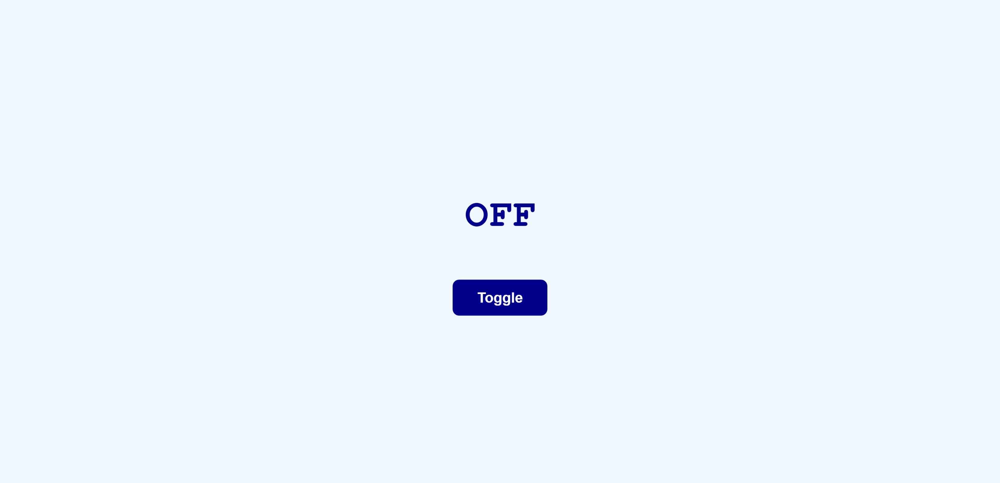

Toggle Text (ON / OFF)

A simple mini project built with HTML, CSS, and JavaScript that toggles text between ON and OFF when a button is clicked.

🎯 Purpose

Practice basic HTML structure
Use CSS Flexbox for layout and responsiveness
Learn JavaScript DOM manipulation and click events

🛠️ Technologies

HTML5
CSS3
Vanilla JavaScript

(No frameworks used)

📂 Files
index.html
style.css
script.js

⚙️ How It Works

Page loads showing OFF
Clicking the Toggle button changes text to ON
Clicking again switches it back to OFF

📱 Responsive Design

Centered layout on all screen sizes
Readable text and properly sized button

Screenshot

